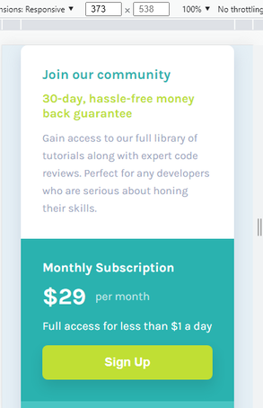
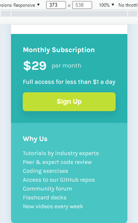

# Single price grid solution

Front-End Mentor | Single price grid solution  

🚀 Completed ✅ 

## Table of contents

- [About](#-about)
- [The challenge](#-the-challenge)
- [Screenshot](#-screenshot)
- [Links](#-links)
- [Built with](#-built-with)
  - [Languages](#languages)
  - [Utilities](#utilities)
- [What I learned](#-what-i-learned) 
- [Author](#-author)
- [License](#-license)

## 💻 About 

This is a solution to the [Single price grid component challenge on Frontend Mentor](https://www.frontendmentor.io/challenges/single-price-grid-component-5ce41129d0ff452fec5abbbc). Frontend Mentor challenges help you improve your coding skills by building realistic projects.

## ⚙️ The challenge

Users should be able to:

- [x] View the optimal layout for the component depending on their device's screen size
- [x] See a hover state on desktop for the Sign Up call-to-action

## 🎨 Screenshot

 

## ⚓ Links

- [Solution URL](https://gustavo-victor.github.io/single-price-grid-solution/)

## 🛠 Built with

### Languages 
- [HTML](https://developer.mozilla.org/pt-BR/docs/Web/HTML) 
  - [Semantic HTML5 markup](https://developer.mozilla.org/pt-BR/docs/Glossary/Semantics#sem%C3%A2ntica_em_html)
- [CSS](https://developer.mozilla.org/pt-BR/docs/Web/CSS)
  - [CSS custom properties](https://developer.mozilla.org/pt-BR/docs/Web/CSS/--*)
  - [Flexbox](https://developer.mozilla.org/pt-BR/docs/Web/CSS/CSS_Flexible_Box_Layout/Basic_Concepts_of_Flexbox)
  - [CSS Grid](https://developer.mozilla.org/pt-BR/docs/Web/CSS/CSS_Grid_Layout/Basic_Concepts_of_Grid_Layout)
  - [Mobile-first workflow](https://developer.mozilla.org/en-US/docs/Web/Progressive_web_apps/Responsive/Mobile_first)

### Utilities 
- **Fonts:** [Karla (400, 700)](https://fonts.google.com/specimen/Karla?query=Karla) 

## 🥇 What I learned

During the creation of this project, I was able to recap some knowledge about CSS grid layout and also about mobile First. 

## 🦸 Author

- GitHub - [@Gustavo-Victor](https://github.com/Gustavo-Victor)
- Frontend Mentor - [@Gustavo-Victor](https://www.frontendmentor.io/profile/Gustavo-Victor)
- CodePen - [@gustavo_victor](https://codepen.io/gustavo_victor)
- Linkedin - [@gustavo-victor](https://www.linkedin.com/in/gustavo-victor-575b93206/) 

## 📝 License

This project is under the MIT license.

Anyone can use, clone, fork and contribute to this project. 
